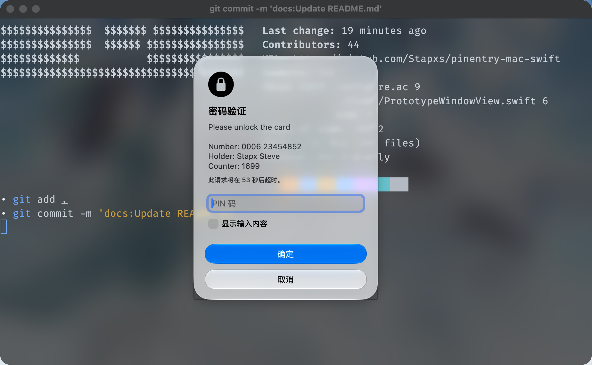
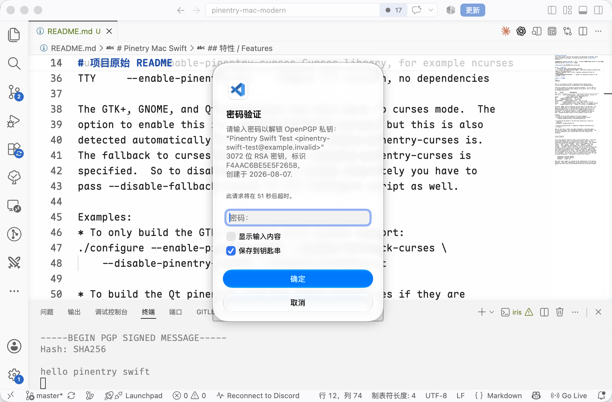

# Pinetry Mac Swift
This clone project rewrites the pinentry mac GUI based on SwiftUI, which supports macOS 13 and above. The code can view the new `macosx-swift` directory.

本克隆项目对 pinentry mac GUI 进行了基于 SwiftUI 的重写，支持 macOS 13 及以上系统，代码可以查看新增的 `macosx-swift` 目录。

## 特性 / Features
- 原生 SwiftUI 界面 / Native SwiftUI interface
- 基于 Pinetry Mac 重写 UI，支持完整功能 / Rewritten UI based on Pinetry Mac, supports full functionality
- Keychain 缓存支持 Touch ID 验证 / Keychain caching with Touch ID authentication
- 支持最大限度的获取发起者的图标 / Support for maximum retrieval of the initiator's icon
- 多语言支持 / Multi-language support

## 安装 / Installation
- 从仓库 Releases 下载 app
- 将 app 拖入应用程序目录或者任何你想要的目录
- 修改 gpg 配置文件 `~/.gnupg/gpg-agent.conf`，将 `pinentry-program` 指向 app 路径下的 `Contents/MacOS/pinentry-mac-swift`
- 重新加载 gpg-agent 配置文件 `gpgconf --kill gpg-agent`

- Download the app from the repository Releases
- Drag the app into the Applications directory or any directory you want
- Modify the gpg configuration file `~/.gnupg/gpg-agent.conf`, and point `pinentry-program` to `Contents/MacOS/pinentry-mac-swift`
- Reload the gpg-agent configuration file `gpgconf --kill gpg-agent`

注意，请不要将 `pinentry-mac-swift` 可执行文件单独分离出 app 使用，这会导致多语言支持失效。
Note that please do not separate the `pinentry-mac-swift` executable from the app for use, as this will cause multi-language support to fail.

## 构建 / Build
构建依赖一些需要安装的工具，请确保 `libassuan`、`secmem` 和 `gpg-error` 已在系统中被安装。
The build depends on some tools that need to be installed. Please make sure that `libassuan`, `secmem`, and `gpg-error` are installed in the system.

~~~shell
xcodebuild -project "macosx-swift/pinentry-mac-swift.xcodeproj" -scheme "pinentry-mac-swift" -c=/prionation Debug -destination 'platform=macOS' -derivedDataPath /private/tmp/pinentry-mac-modern-build build
~~~

## 感谢 / Acknowledgements
- 本项目使用 GPT 5.5 辅助完成 / This project was assisted by GPT 5.5
- 感谢 [pinentry-touchid](https://github.com/jorgelbg/pinentry-touchid) 项目对 Touch ID 相关功能的灵感 / Thanks to the [pinentry-touchid](https://github.com/jorgelbg/pinentry-touchid) project for inspiration on Touch ID related features

----
----

# 项目原始 README
~~~
PINEntry
---------

This is a collection of PIN or passphrase entry dialogs which
utilize the Assuan protocol as specified in the Libassuan manual.

There are programs for different toolkits available.  For all GUIs it
is automatically detected which modules can be built, but it can also
be requested explicitly.

GUI		OPTION			 DEPENDENCIES
--------------------------------------------------------------------------
GTK+ V2.0	--enable-pinentry-gtk2	 Gimp Toolkit Library, Version 2.0
					 eg. libgtk-x11-2.0 and libglib-2.0
GNOME           --enable-pinentry-gnome  GNOME
Qt		--enable-pinentry-qt	 Qt (> 4.4.0)
TQt		--enable-pinentry-tqt	 Trinity Qt
Enlightenment	--enable-pinentry-efl	 EFL (>= 1.18)
FLTK		--enable-pinentry-fltk	 Fast Light Toolkit (>= 1.3)
Curses		--enable-pinentry-curses Curses library, for example ncurses
TTY		--enable-pinentry-tty	 Simple TTY version, no dependencies

The GTK+, GNOME, and Qt pinentries can fall back to curses mode.  The
option to enable this is --enable-fallback-curses, but this is also
detected automatically in the same way --enable-pinentry-curses is.
The fallback to curses also works if --disable-pinentry-curses is
specified.  So to disable linking to curses completely you have to
pass --disable-fallback-curses to the configure script as well.

Examples:
* To only build the GTK+ pinentry with curses support:
./configure --enable-pinentry-gtk2 --enable-fallback-curses \
	--disable-pinentry-curses --disable-pinentry-qt

* To build the Qt pinentry, and the other pinentries if they are
  supported:
./configure --enable-pinentry-qt

* To build everything that is supported (complete auto-detection):
./configure

Some of the code is taken from Robert Bihlmeyer's Quintuple-Agent.
For security reasons, all internationalization has been removed.  The
client is expected to tell the PIN entry the text strings to be
displayed.

Curses Pinentry
---------------

The curses pinentry supports colors if the terminal does.  The colors
can be specified by the --colors=FG,BG,SO option, which sets the
foreground, background and standout colors respectively.  The standout
color is used for error messages.  Colors can be named by any of
"black", "red", "green", "yellow", "blue", "magenta", "cyan" and
"white".  The foreground and standout color can be prefixed by
"bright-", "bright", "bold-" and "bold", and any of these prefixes has
the same effect of making the color bolder or brighter.  Two special
color names are defined as well: "default" chooses the default color,
and "none" disables use of colors.  The name "none" is only meaningful
for the standout color and in this case a reversed effect is used for
error messages.  For the other colors, disabling colors means the same
as using the defaults.  The default colors are as follows:

	Foreground:	Terminal default
	Background:	Terminal default
	Standout:	Bright red

Note that color support is limited by the capabilities of the display
terminal.  Some color combinations can be very difficult to read, and
please know that colors are perceived differently by different people.
~~~